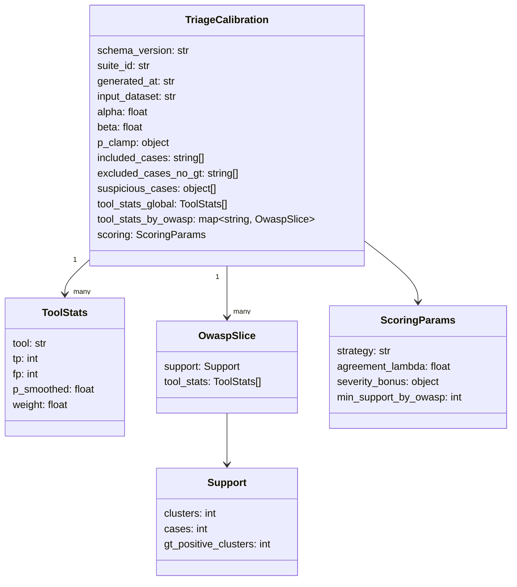

# Triage calibration QA runbook

This repo supports a **suite-level triage calibration** workflow.

At a high level:

1. **Per-case analysis** writes per-case artifacts (including `triage_features.csv` and `triage_queue.csv`).
2. A **suite-level builder** aggregates features across cases into `analysis/_tables/triage_dataset.csv`.
3. A **calibration builder** learns per-tool weights from GT and writes `analysis/triage_calibration.json` (plus a CSV report).
4. A **suite eval** summarizes baseline vs calibrated strategies.

Because the calibration JSON is produced at the *suite level*, the calibrated score (`triage_score_v1`) cannot be
applied to per-case `triage_queue.csv` **until after** calibration has been built.
The QA command below performs a second “analysis-only” pass to ensure per-case outputs pick up the calibration.

## CLI helper

The QA helper is implemented as **flags on suite mode**:

- `--qa-calibration` enables the runbook
- `--qa-scope smoke|full` chooses which OWASP slices to run
  - `smoke` → only **A03 + A07**
  - `full` → **A01–A10**
- `--qa-owasp A03,A07` (optional) overrides the scope with an explicit OWASP id list (comma-separated). You can also use a range like `A01-A10`.
- `--qa-no-reanalyze` (optional) skips the second analysis-only pass (not recommended for end-to-end QA).

If you don’t provide suite sources, the command will try these defaults (in order):

1. `examples/suite_inputs/durinn-owasp2021-python-micro-suite_cases.csv`
2. `repos/worktrees/durinn-owasp2021-python-micro-suite`

If neither exists, pass one of: `--suite-file`, `--cases-from`, or `--worktrees-root`.

## Expected artifacts

After the QA command completes, it validates these artifacts exist under `runs/suites/<suite_id>/...`
(where the most recent suite id is stored in the pointer file `runs/suites/LATEST`):

- `analysis/_tables/triage_dataset.csv` exists
- `analysis/triage_calibration.json` exists
- `triage_calibration.json` includes **>= 1 GT-supported case** (included_cases is non-empty)
- `analysis/_tables/triage_calibration_report.csv` exists
- per-case `triage_queue.csv` exists for all cases
- per-case `triage_queue.csv` contains the column `triage_score_v1`
- if re-analyze is enabled (default), at least one `triage_score_v1` value is non-empty
- the suite `triage_eval_summary.json` includes the `calibrated` strategy

The filesystem-first validator lives at:

- `pipeline/analysis/qa_calibration_runbook.py`

---

## Calibration JSON schema (v2)

The suite-level calibration output (`analysis/triage_calibration.json`) is a versioned contract.
It contains both **global** weights and optional **per-OWASP** weights.

### How scoring chooses weights

When computing `triage_score_v1` for a cluster:

1) If the cluster has an OWASP id (A01..A10) **and** that slice exists in the JSON **and**
   `support.clusters >= min_support_by_owasp`, use that slice’s tool weights.
2) Otherwise, fall back to `tool_stats_global`.

This makes calibration robust when category-specific data is sparse.

---

## GT tolerance note (matching sensitivity)

Calibration learns from GT overlap labels. If GT markers are not placed on the exact sink line,
an exact location match can produce 0 overlaps and misleading weights.

Use the deterministic `--gt-tolerance` knob for scored suites, and prefer a tolerance sweep
(compare eval summaries across tolerances) instead of guessing.

## Notes for non-scored suites (e.g. Juice Shop)

Suites without ground truth (GT) are **not good calibration candidates**.

Today the QA checklist assumes a “scored” suite where calibration + eval are meaningful.
When extending this QA approach to non-scored suites, we’ll likely want a different checklist,
for example:

- validate per-case analysis artifacts exist
- validate triage queue schema invariants
- skip (or soft-warn) on calibration/eval expectations

This doc is the canonical place to keep those future adjustments.
