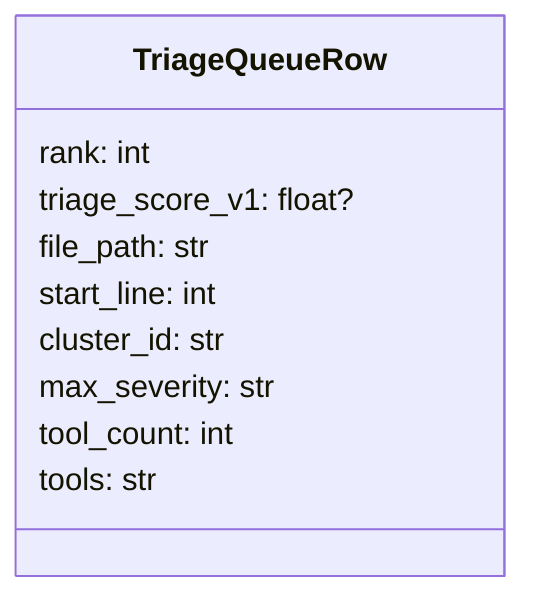

# Triage queue contract (schema + deterministic ranking)

This project treats the triage queue artifact (e.g., `triage_queue.csv`) as a **public contract** between:
- analysis stages that compute clusters and scoring, and
- downstream consumers (QA runbook, eval, CI guardrails, and humans reviewing findings).

## Why enforce a schema?

We always emit the same columns so that:
- QA can reliably verify calibration integration (even when calibration is missing),
- eval/CI scripts can parse the queue without brittle “if column exists” logic,
- future changes (new scores, new fields) can be added without breaking tooling.

In particular, `triage_score_v1` must always exist as a column so that “calibrated vs not calibrated” is expressed by **values**, not by schema shape.

## Why deterministic tie-breaks?

Triage ranking often produces ties (same severity, same tool_count, etc.). If ties are not broken deterministically:
- repeated runs can reorder rows even with identical inputs,
- regressions become noisy (false diffs),
- it becomes impossible to attribute changes to calibration logic vs incidental ordering.

So we require stable tie-break keys and a deterministic sort order.

## Required columns (current contract)

The ranked triage queue output must include (at minimum):

- `triage_score_v1` (may be empty when calibration is unavailable)
- `tool_count`
- canonical severity field: `max_severity`
- stable identity / tie-break keys:
  - `file_path` (or `rel_path` if you standardize on that later)
  - `start_line`
  - `cluster_id`

Additional columns are allowed, but these must remain present.

## Sorting rules

When calibration exists (suite has `analysis/triage_calibration.json`):
1. Primary sort: `triage_score_v1` **descending**
2. Tie-break: fall back to the legacy deterministic ordering (severity, tool_count, etc.)
3. Final tie-break must include `cluster_id` to guarantee a total ordering

When calibration is missing:
- Preserve existing behavior unchanged, but still emit the same schema (including `triage_score_v1`).

## Notes for non-scored suites (e.g., Juice Shop)

Suites without GT/scoring may not produce meaningful calibration weights. For those suites:
- `triage_score_v1` should still be present as a column (typically empty),
- the queue still must be deterministic via the tie-break keys,
- QA/CI checks should not require the calibrated strategy or non-empty scores unless GT exists.

This keeps the pipeline consistent across “scored” and “non-scored” suites while avoiding false failures.
